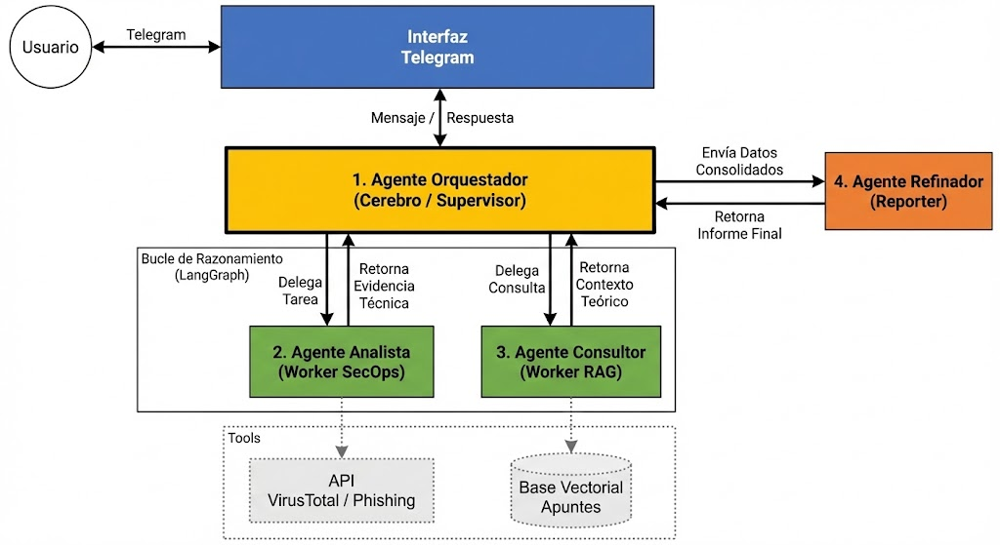

Trabajo de Fin de Grado para el Grado en Ingeniería de la Ciberseguridad en la URJC.

Consiste en un chatbot de Telegram basado en Agentic AI para tareas de ciberseguridad.
Cuenta con Tools para que el agente analista se comunique con la API de virustotal y un RAG para que el agente consultor base su respuesta en apuntes de la carrera.

Este es el diagrama de la arquitectura:

